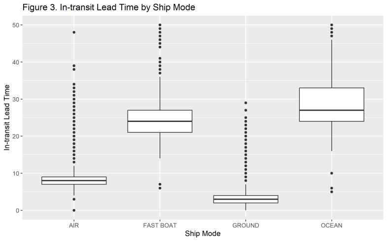

# Supply Chain Lead Time Analysis (R)

**Preparing and exploring 9,124 shipment records so a technology manufacturer can better predict when its products will arrive at warehouses.**

This project focuses on **data preparation and exploratory analysis**: turning messy logistics data into a clean, structured dataset that is ready for future predictive modeling. It is not a forecasting model.

**[Read the full report (PDF)](FinalProject_21%20-%20Copy.pdf)** · **[View the R script](STA4233_Final_Project.R)**

---

## The business problem

ABC (a fictional company in the course case study) manufactures and ships desktop and laptop products across North America and Latin America. Because of supply chain disruptions, it struggled to predict shipment arrival times and manage customer expectations.

The goal was to prepare its shipment data and explore what affects lead time, from **manufacturing sites to warehouses**, across different **shipping modes**.

## What I did

| Step | Details |
|---|---|
| **Combined data** | Imported two Excel worksheets (shipments and a calendar) and matched each shipment's receipt date to the calendar to add **Quarter** and **Year** without hard-coding dates |
| **Engineered lead time variables** | **Manufacturing lead time** = Ship Date − PO Download Date<br>**In-transit lead time** = Receipt Date − Ship Date |
| **Cleaned categories** | Trimmed spaces, standardized capitalization, and fixed inconsistent labels (e.g., `FASTBOAT` → `FAST BOAT`) |
| **Fixed invalid values** | Treated negative lead times as impossible (a shipment can't arrive before it ships) and flagged extreme outliers with the **IQR rule** |
| **Imputed missing values** | Filled missing lead times with the **median for the same origin and ship mode**, falling back to the overall median when needed |
| **Kept the data intact** | Removed only rows that were mostly empty: **8,979 of 9,124 rows (98%) retained** |
| **Explored the data** | Summary statistics, histograms, boxplots, bar charts, and a scatterplot |
| **Correlation analysis** | One-hot encoded the categorical variables (LOB, Origin, Ship Mode, Quarter) and built a full correlation matrix |

## What the exploration showed



- **Ship mode is the biggest driver of transit time.** Average in-transit lead time ranged from **3.8 days by ground** and **8.5 by air** to **24.8 by fast boat** and **29.5 by ocean**. Shipping by ocean had the strongest correlation with transit time of any variable (**r = 0.81**).
- **Origin site matters too.** Site B averaged the longest transit time (**25.9 days**) and Site D the shortest (**3.8 days**). Site D and ground shipping have identical counts (2,394) and averages, which suggests all Site D shipments moved by ground. That means origin and ship mode effects overlap, which future modeling should account for.
- **Manufacturing time is only weakly related to transit time** (r = 0.34), so delays mostly come from transportation rather than production.

These are exploratory patterns, not causal conclusions. The cleaned dataset is the foundation for a future model that predicts arrival dates.

## Tools

R · readxl · dplyr · tidyr · lubridate · stringr · janitor · ggplot2 · fastDummies · corrplot

## Repository contents

```
STA4233_Final_Project.R        Full R script: import, cleaning, imputation, EDA, correlations
FinalProject_21 - Copy.pdf     Final report with all tables and figures
images/                        Chart used in this README
```

## About

Team project for **STA 4233 – R Programming for Data Science** at the University of Texas at San Antonio, completed with Kartheek Reddy Vontela. The shipment dataset was provided for the course.

**Victoria Reyna** · [LinkedIn](https://www.linkedin.com/in/victoria-reyna21) · [GitHub](https://github.com/vrey21)
